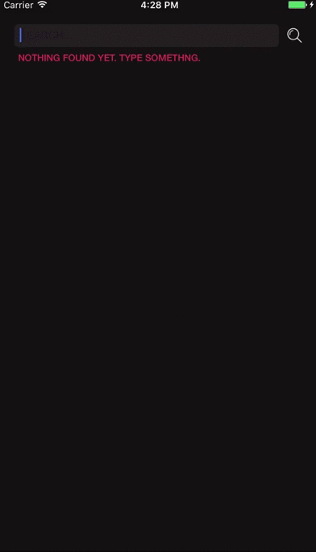

# Reveal


### Description
Reveal is small utility to perform reveal/hide animation on UILabel.



### Installation - CocoaPods
To install add following line to your Podfile:

`pod Reveal`

### How To Use Reveal

##### 1) create instance of Reval and add some options

`let reveal = Reveal(options:[.direction(.fromLeft), .speed(2)])`

##### 2) pass label instance

`reveal.add(someLabel)`

#### 3) reveal label when ready!

`reveal.reveal()`

#### 4) To reverse animation call:

`reveal.hide()`

### Features

#### You can pass array of labels and Reveal show them in order

```
let reveal = Reveal(options:[.delay(0.6)])
reveal.add([label1, label2, label3])
reveal.reveal()
```

#### Completion handler

```
reveal.reveal {
  print("all labels are visible now.")
}
```

#### You can track when particular animation ended

```
reveal.reveal { index in
print("label at \(index) is visible now.")
}
```

### Options
- animation speed in speconds
```
speed(Double)
```
- delay in seconds between animations
```
delay(Double)
```
- Edge where animation starts from
```
direction(RevealDirection)
```

### Update Log
#### 0.3 Release (26.10.2016)
- first release

